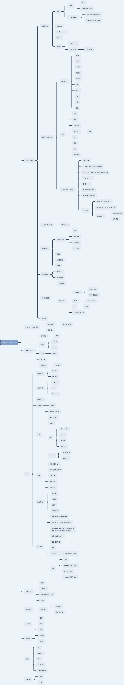

# My Computer Science Knowledge System

## 计算机基础

### 编程语言

- C/C++/Java
- iOS
  - Swift
    - 官方
    - Advanced Swift
  - Objective-C
    - Effective Objective-C
    - Objective-C 高级编程
- Python
- “SQL”
- 前端
  - HTML/CSS
  - JavaScript
    - TpyeScript

### 算法与数据结构

- 数据结构
  - 数组
  - 链表
  - 字符串
  - 哈希表
  - 位操作
  - 栈
  - 队列
  - 堆
  - 树
  - 图
- 算法
  - 排序
  - 递归
  - 二分搜索
  - 动态规划
    - 回溯
  - 指针
  - 贪心
  - 分治
  - 海量数据
- 书籍与课程（面试）
  - **LeetCode**
  - Cracking the coding interview
  - The element of programming interview
  - Algorithm 4th
  - **剑指 Offer**
  - 程序员面试白皮书
  - 程序员代码面试指南
  - Google
    - Next 项目: Handbook
    - [Advanced Programming](https://techdevguide.withgoogle.com/paths/advanced/compress-decompression#!)
    - KickStart
      - Online Course
      - 往届题目

### 计算机体系结构

- [深入理解计算机系统 CSAPP](https://wdxtub.com/csapp/thin-csapp-0/2016/04/16/)

### 操作系统

- 进程与线程
  - 区别
  - 调度算法
  - 进程同步
  - 进程通信
- 死锁
- 内存管理
- 编译

### 编译原理

- 语言相关
- 链接相关

### 计算机网络

- 分层结构
- 各层应用
  - TCP/UDP
    - 区别，应用
    - TCP 拥塞控制
  - HTTP
    - HTTP/HTTPS
  - IP
    - 计算
  - Cookie/Session

### 数据库

## 软件架构与设计模式

### 设计模型

- 常见设计模式

### **系统设计**

## 传统应用

### 移动开发

- iOS

### 前端

- React
- VUE

### 后端

- Flask

### **嵌入式**

### **游戏开发**

- DirectX

## AI

### **数据分析**

- Pandas
- Numpy

### 机器学习

- 逻辑回归
- SVM
- K-Means

### 深度学习

### **大数据**

- **Hive**

### 工具

- Numpy/Pandas
- scikit-learn
- CNTK
- DP
  - TensorFlow
  - Keras
  - MXNet
  - Pytorch
- 可视化
  - matplotlib
  - [plot](https://plot.ly/)

### 应用

- 计算机视觉 CV
- 自然语言处理 NLP
- **推荐系统**
- 搜索系统
- 计算广告

### 数学基础

- **统计学**
- 微积分
- 矩阵
- 线性代数

### 书/课程

- Python for Data Analysis
- Python data science Handbook
- **Hands-On Machine Learning with Scikit-Learn and TensorFlow**
- **李航-统计学习方法**
- **百面机器学习**
- 推荐
- 深度学习入门，基于Python的理论与实现
- 参考
  - 花书
  - 动手深度学习 MXNet
  - MIT 深度学习
  - Keras 深度学习实战

## 软件工程

### 需求

### 软件测试

### 软件开发一系列文档

### 管理

## 信息安全

### 加密算法

- 对称加密
- 非对称加密